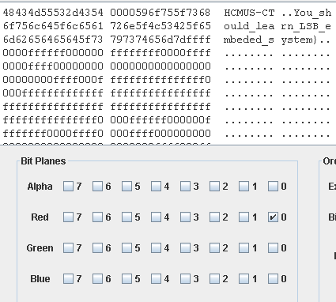

# Actual_at_least (150 pts)

Using the experience of solving the `AtLeast` challenge, we use StegSolve (https://github.com/eugenekolo/sec-tools/tree/master/stego/stegsolve/stegsolve) to examine the image. Using the hint "I like Red", we try to extract LSB of Red channel and voilà!

the flag HCMUS-CTF{You_should_learn_LSB_embedded_system} appears.

