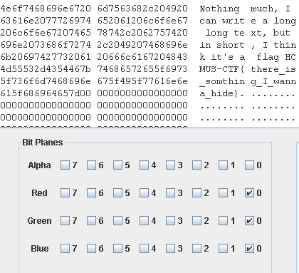

# AtLeast (50 pts)

First we try to examine EXIF and metadata of the given image but to no avail. Then we use StegSolve (https://github.com/eugenekolo/sec-tools/tree/master/stego/stegsolve/stegsolve) to examine the image, and see some suspicious marks at Red, blue and green plane 0 (or the least significant bit of RGB). So we extract it and voilà!

The flag HCMUS-CTF{there_is_something_I_wanna_hide} appears.
