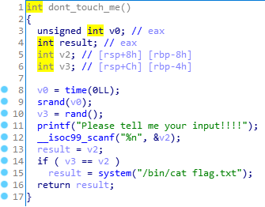
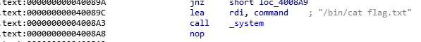

# Find me (108pt)

Look at the main function, we found nothing just puts and gets function. Looking through the program, we found a dont_touch_me function.

%n gets number of bytes written and compare with a random generated number. If they are equal then it get the flag.

First strategy of our team is try to bypass the random function. Since the random function use the current time in second as seed, so we can get the value beforehand, and write that amount of bytes to get the flag. Unfortunately, the random value is too large for us to do that.

So instead of changing the control flow to the begining of dont_touch_me function, we change it to where it gets the flag.

Back to main function, we need to override the return address with 0x40089C to get the flag.

v4 is at $rbp - 0x80 so we have to pad 0x80 + 0x4 = 132 bytes and then 0x400089C to override the return address

Send the payload to server and get the flag

    flag = HCMUS-CTF{You_know_how_to_use_some_existing_code}