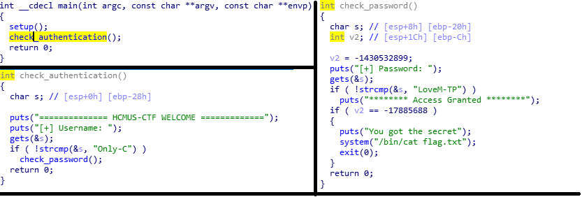

# Hackme (100pts)

Decompile the program with IDA, we get the following functions

To pass check authentication, we provide the string "Only-C", and to pass check password with string "LoveM-TP" then we have to overflow v2 with -17885688

s is at $esp + 0x8, v2 is at $esp + 0x1c, so we have to write 0x1c - 0x8 = 0x14 (20 bytes) and then -17885688 (0xfeef1608)

Send all the payload to the server to get the flag
    
    flag: HCMUS-CTF{That_was_the_way_You_H@ck3ed_ME}
