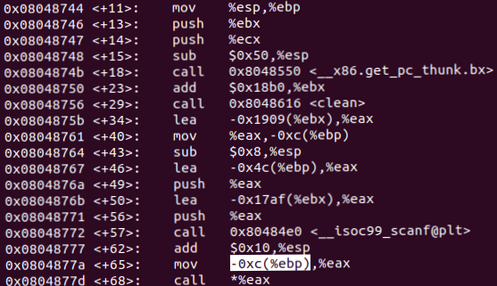

# SimpleBOF (50pt)

This goal of this problem is to override fp with address of success function and get the flag
Open GDB to get the offset of the stack

Buffer is at $ebp - 0x4c, then it move content at ($ebp - 0xc) to $eax and call *$eax. We want the address of success function at $ebp - 0xc so we pad (0x4c - 0xc = 0x40) 64 bytes with "A" then the the address of success function.

	payload = b"A" * 64 + p32(0x08048670)		# 0x08048670 is the address of success function

Send the payload to the server and get the flag

	flag = HCMUS-CTF{Easy_to_change_function_pointer!!}
