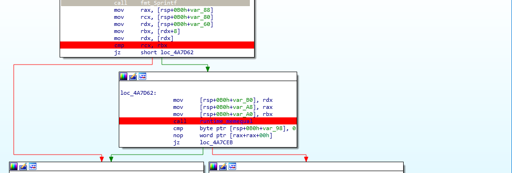

# CrackMe01 (133pts)

Open file with IDA, we notice that this file is not a binary written in C or C++

By doing some research we know that it is written in Go. Then continue to google for entry point of this binary file (same as the main function in C), we found that the entry point of this file is main.main function.

We notice some familiar function such as Fprintln, Fscanf. Another important point is that before all call instruction, it loads all of arguments into stack.

In the main.main function we notice this section. 

It first compare 2 register rcx and rbx, then if they are equal, it calls memequal function. memequal function is used to compare 2 string in Go. So now, we will first try to bypass the first comparison, put a breakpoint before the memequal and read the argument of this function. Hopefully it contains the flag.

Put the breakpoint at the first comparison, we notice it compare the length of the input string and 0x1B (=27)

Run it again with input is 27 A letters. We can see that rdx pointing to our input string and rax pointing into our flag. Follow rax to get the flag.

    Flag: HCMUS-CTF{s@uri3ngkh0nGhAt}