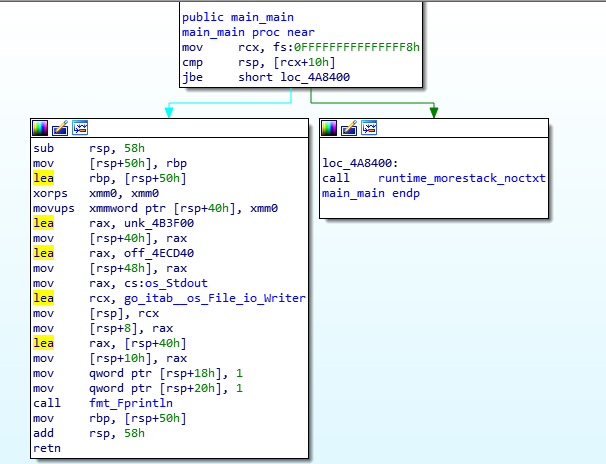
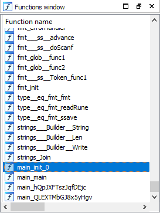
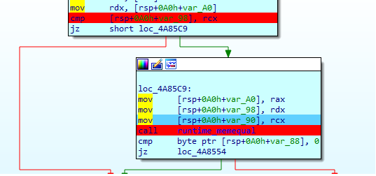

# CrackMe02 (195pts)
Another Go program. Going to the main.main function, we get nothing. The main function just print "Nothing here" to the console.

But running the program, it read an input, do something, and then told us the wrong before print "Nothing here". This is weird.

Then by googling around, we realize that in main package, init function runs before main function. Checking list of all function in IDA, we found init function. 

In init function, it call another function. Look into this function we see some important call, another compare and a memequal call. 

So the strategy is the same as before. Once again, it compare the length of the input string with 0x1B and use memequal to compare the input string with the flag.

    flag: HCMUS-CTF{7s2tp^nYahN%hFv=}

P/S: The difference between 2 versions is that the first version save the flag in plain text and then retrive the flag via a string format. The second version save the encoded string and use a function to get decode the flag. But both version uses the memequal to compare the input string and the flag. Hence it is not necessary to reverse the decode function.