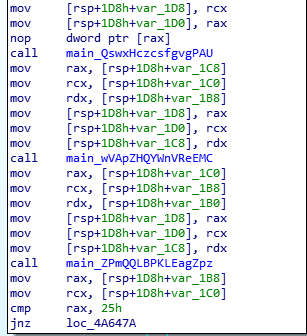
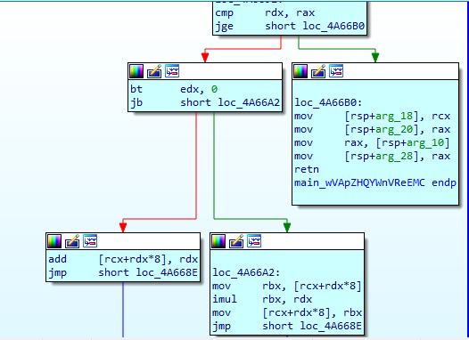
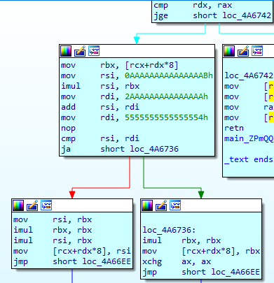

# CrackMe03 (200pt)

This version is trickier than the first two versions. Looking at the init function. It call main.RAR... function
In main.RAR function it read the input and call 3 function consecutively.

In the first function, it returns the string to rax, each character is 8 bytes wide, and the length of the input string in rcx and a value in rdx (???). 

Then the second function use the three output of the first function as argument.

The pseudocode for the second function is as below, and then return the string after modified and the length of the string.

    for i in range(len(s)):
        if i & 1:               // i odd
            s[i] = s[i] * i
        else:                   // i even
            s[i] = s[i] + i

Then the string and the length is again used as arguments for the last function.
The pseudocode for the last function is as below, and then return the string after modified and the length of the string.

    for i in range(len(s)):
        x = 0xAAAAAAAAAAAAAAAB
        x *= s[i]
        x += 0x2AAAAAAAAAAAAAAA
        if x > 0x5555555555555554:
            s[i] = s[i] * s[i]
        else:
            s[i] = s[i] * s[i] * s[i]

Back to main.RAR.. function, after encode the input string, it checks for the length of the input string with 0x25 (37). Then it loop over the string and compared the encoded input string with a predefined array.

So, to get the flag, we reverse the procedure with this [script](Solve.py) to get the flag.

    Flag: HCMUS-CTF{cHuc_m$ng_ban_d@_den_bAi_3}

P/S: This version is trickier than the first 2 versions because it compared the encoded input string with the encoded flag. Therefore we have to reverse the encode procedure to get the flag. In the first two version this procedure is handled by the program itself.

