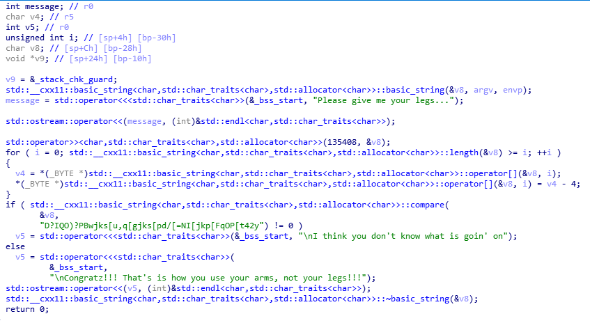

# Notyourleg (122pts)
This is an executable file compiled using ARM instructions
Using IDA to decompile the file we get the main function

We can see it is written in C++ and using std::string, therefore it is hard to read the assembly code

It loops over the input string, minus all the char by 4 then compare with the string "D?IQO)?PBwjks[u,q[gjks[pd/[=NI[jkp[FqOP[t42y"

So to get the flag, we add 4 to the predefined string with this [script](Solve.py)

    Flag: HCMUS-CTF{now_y0u_know_th3_ARM_not_JuST_x86}