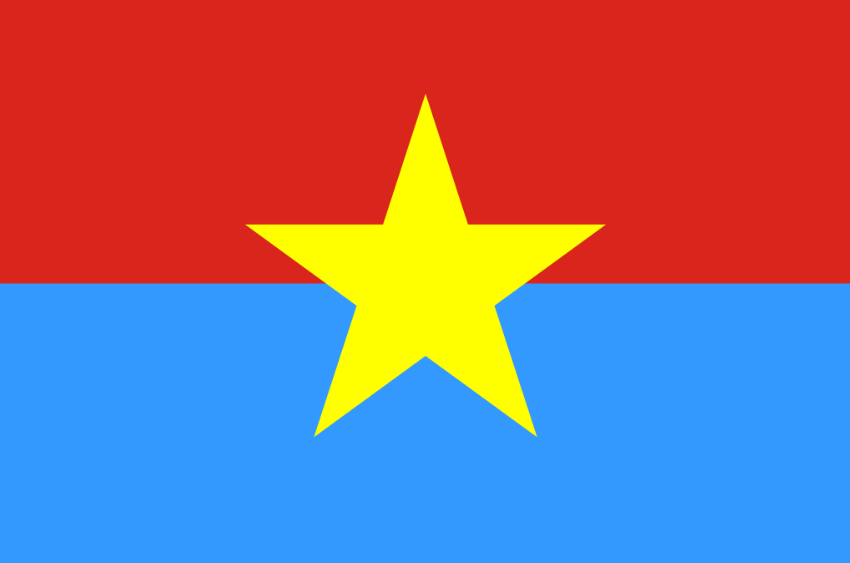

# Liberate (50 pts)

This is a day of glory. A mighty tank rams Independence Palace. If we can unify the country, then finding a flag is just a trivial task. To solve this challenge,  you must borrow the spirit of Uncle Ho's soldier, so the first step is to get a book about "Revolution Directions of the Vietnamese Communist Party", make a careful study about the 1975 age, the second step is to contemplate the portrait of Uncle Ho and the Viet Cong **flag**. The **flag** is now "thấm-nhuần" in your head. You may say that we want the flag, not the **flag**, but the truth is, flag is **flag**.

So the **flag** is:



All jokes aside, after examining the EXIF and metadata of the given image, we get a hint that the flag is encoded in base 85 and some cryptic text. 

```
84-*O;_ @97XK8VARo.6;aX,J3&P&SDI[TqATE2
```

Decoding the text in base85 fails, because of a twist: the base85 encoded text must not contain space (ASCII 32), but the cryptic text does (note the 8-th character). So we need to "fix" the space to another character. How we fix it? We know 10 first characters of the flag are "HCMUS-CTF{", so we will encode them using base85 to get:

```
84-*O;_:@97XG
```

Voilà! The space is supposed to be a colon. Decode the fixed cryptic text, we get the flag (not the **flag**). The flag is HCMUS-CTF{uSed_ASCII85_encoder}

