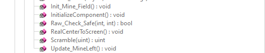
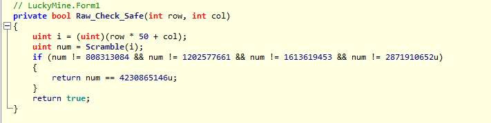
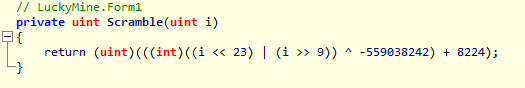

# Challenge Lucky Mine (200 pts)

First use ILSpy to disassemble the program. We can see the table size is 50x50, with 2495 mines, and 5 safe cell.

We see a function name Raw_Check_Safe(int, int) to check a safe cell.

Raw_Check_Safe call Scramble function

There are 5 safe place, so we can bruteforce to find 5 safe cell. This is the [script](LuckyMine.cpp)

Click on 5 safe cell, we get the flag: HCMUS-CTF{C_SHARPez}