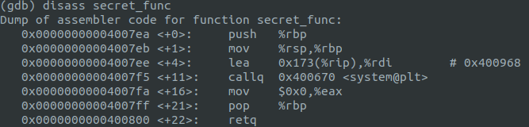
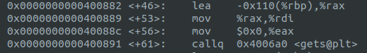

# Challenge Flowme (150pts)
This is a buffer overflow challenge. We need to get to secret_func to get the flag.

Fist use gdb to find the size of the buffer and the address of secret_func.

Secret_func address is 0x4007ea 

Dissassemble main function to get the size of the buffer. The size of the buffer is 0x110 - 0x8 = 0x108 = 264 bytes

The input string should fill the 264 byte of buffer and override return address with address of the secret function to cat the flag.

The exploit [script](solve.py).